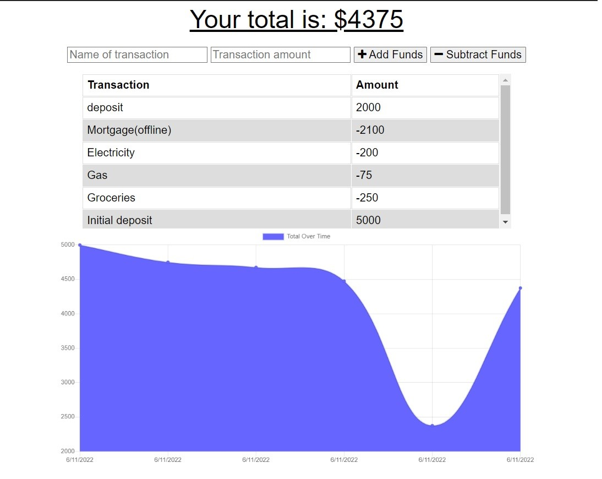

# Budget Tracker PWA

## Module 19 Challenge

## Description

This application is a budget tracker that has both online and offline functionality. The application gives the user the opportunity to manage their funds whether or not an internet connection is available. This ensures that the user will have an access to an accurate balance.

Any transactions that are made while the user is offline will be updated locally so that the user can see a running total. Once an internet connection is re-established, the tracker total will update in the app and the user will receive a notification that the transactions have been added to the transaction history.

## Usage

An example of the application can be accessed on [Heroku](https://desolate-chamber-00936.herokuapp.com/)

## License

This application is covered under [The MIT License](https://opensource.org/licenses/MIT).

## Questions

GitHub:
<https://github.com/EvelynAguirreOrtiz>

Please send requests for additional information to:
<evelyn.aguirre.9895@gmail.com>
